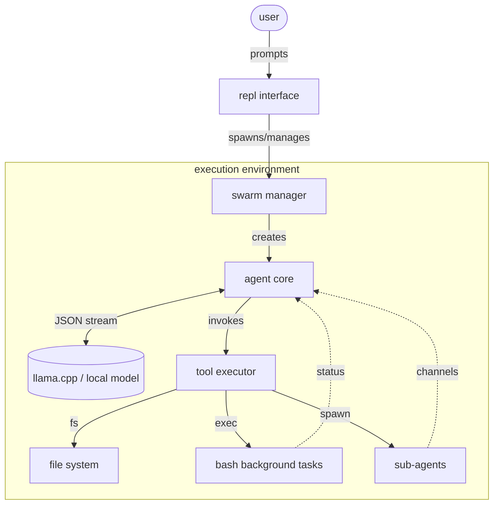
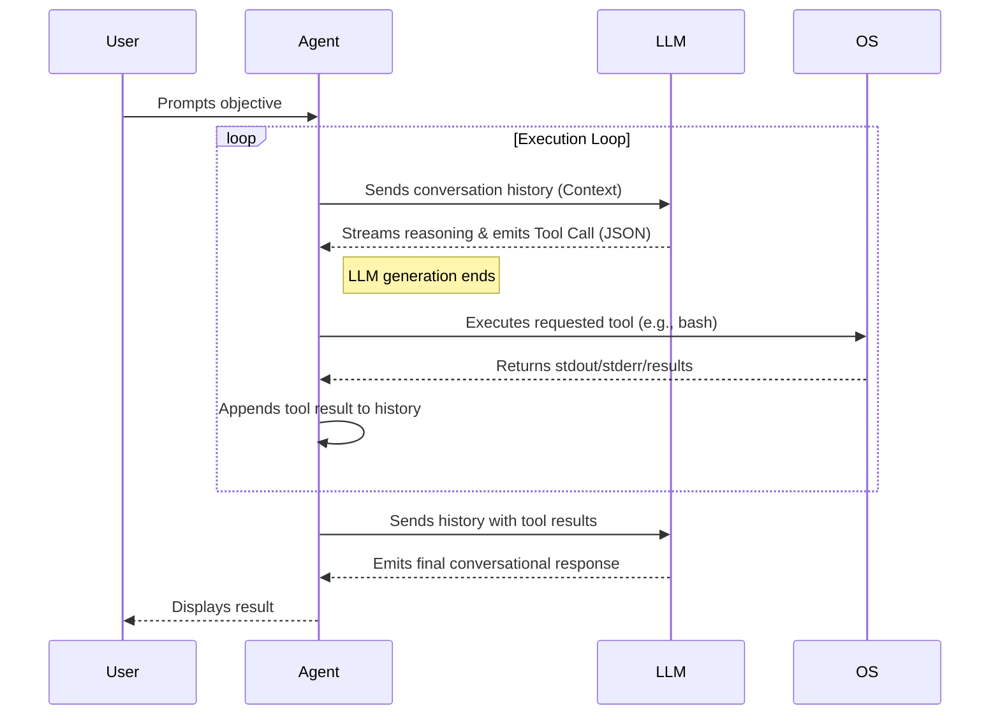

# maquis

a minimalist, zero-bloat terminal harness for autonomous agents.
built in go. highly optimized for local models via llama.cpp.

no heavy frameworks. no visual noise. just raw execution.

---

### ARCHITECTURE

maquis operates on a continuous feedback loop. you type a prompt. the agent reasons, spawns tasks, executes commands on your local machine, reads files, and iterates until the objective is complete.



### DEPENDENCIES

less dependencies means a smaller attack surface. 

```go
require (
	github.com/alecthomas/chroma/v2 v2.14.0
	github.com/spf13/cobra v1.10.2
	golang.org/x/sys v0.44.0
	golang.org/x/term v0.43.0
)
```

### INSTALLATION

requires go 1.21+.

```bash
go mod tidy
go build -o maquis
```

---

### USAGE

start a standard interactive session:
```bash
./maquis
```

start a session with a direct objective:
```bash
./maquis "audit the network layer and patch vulnerabilities"
```

bypass all execution safety prompts (use with caution):
```bash
./maquis --yes
```

#### session management

sessions are persistent. state is automatically written to disk.

```bash
./maquis session list
./maquis session new
./maquis --resume
./maquis --session <uuid>
./maquis session clear
```

#### configuration

by default, configuration is stored in `~/.maquis/config.json`.
the harness is heavily optimized for `llama.cpp`.

```bash
./llama-server -m models/your-model.gguf -c 4096 --port 8080
```

override configuration variables on the fly:
```bash
./maquis --endpoint http://localhost:8080/v1 --model local-model --thinking
```

---

### AGENT CAPABILITIES

maquis equips the LLM with direct access to your local machine.

- `bash`: run commands, compile binaries, start servers.
- `background tasks`: run long-running tasks asynchronously without blocking the main event loop.
- `file ops`: read files, search codebase (grep), overwrite, and surgical line-by-line replacements.
- `subagents`: spawn child agents to delegate sub-tasks.
- `memory`: load custom operational protocols (`~/.maquis/MAQUIS.md`) and project-specific state (`MEMORY.md`).



---

### PLUGINS & EXTENSIONS

maquis is extensible at runtime without recompiling the core binary.

#### tools
drop any executable script into `~/.maquis/plugins/` or `<workspace>/plugins/`.
if called with `--info`, it must return a JSON schema describing its parameters. if called normally via stdin, it executes the operation. the agent instantly gains this capability.

#### slash commands
drop any executable script into `~/.maquis/extensions/`.
when you type `/your-script` in the REPL, the script executes. maquis pipes the entire conversation history into its `stdin` for custom telemetry, analytics, or state injection.

---

### DISCLAIMER

maquis executes commands directly on your local system. running an uncensored or unpredictable model with `--yes` (auto-approve) can destroy your file system. 

use a sandbox. use source control. you have been warned.

license: MIT

author: Lucian BLETAN
